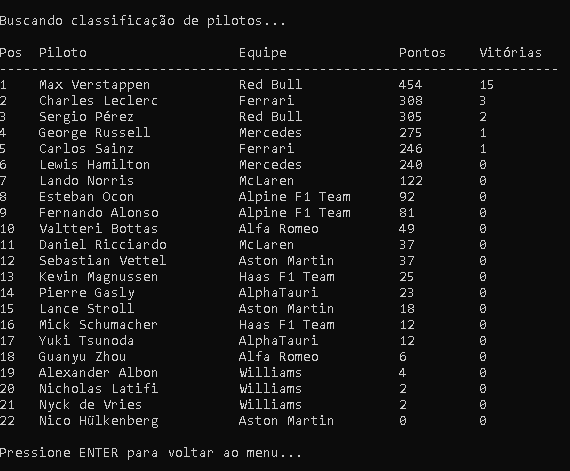
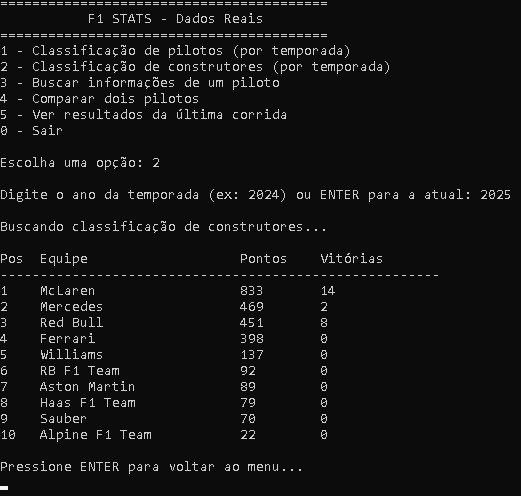
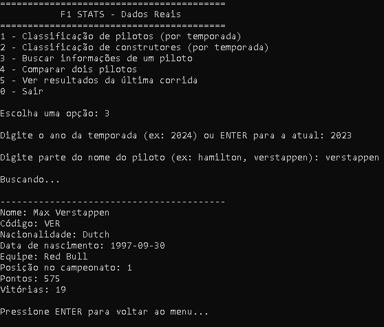
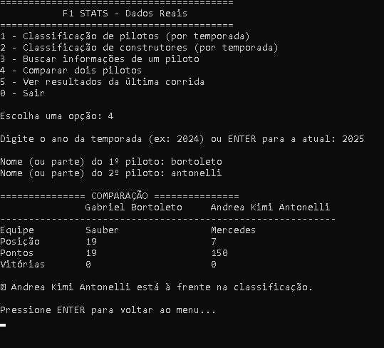
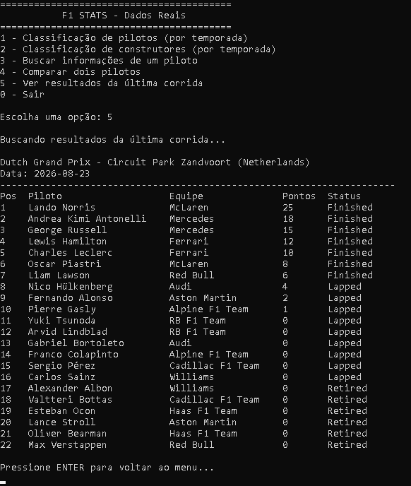

# F1 project by Guilherme Caetano — Estatísticas Reais de Fórmula 1 observadas através de uma API pública em tempo real.

Aplicativo de console em C# que consome dados **reais** de Fórmula 1
através de uma API pública (Jolpica-F1).

## Funcionalidades

- Classificação de pilotos por temporada
- Classificação de construtores (equipes) por temporada
- Busca de informações de um piloto específico
- Comparação entre dois pilotos (pontos, vitórias, posição)
- Resultados da última corrida realizada

## Tecnologias e conceitos usados

- Consumo de API REST com `HttpClient`
- Desserialização de JSON com `System.Text.Json`
- Programação assíncrona (`async`/`await`)
- Organização em camadas (Models / Services / Program)

### Menu principal

### Classificação de pilotos por temporada

### Classificação de construtores por temporada

### Busca de piloto específico

### Comparação entre pilotos

### Resultado da última corrida

